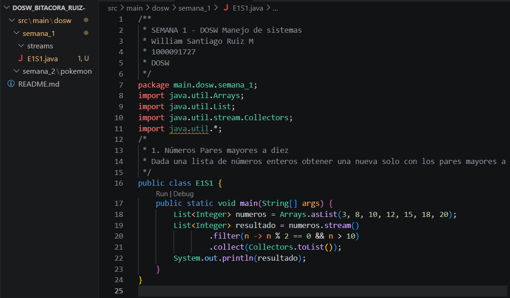
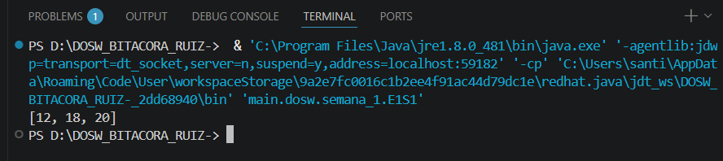

#SEMANA No 1 - DOSW Manejo de Streams 

## Datos Personales: 
- William Santiago Ruiz Medina
- ID: 1000091727
- DOSW 

### E1S1 - Números Pares mayores a diez

Dada una lista de números enteros obtener una nueva solo con los pares mayores a 10

**Codigo:**

**Captura de ejecución**

**Explicación**

Se crea una lista de enteros determinada, se filtra por los que cumplan con que sean pares y mayores que 10, se hace .collect y esto es lo que se mete en una nueva lista 

