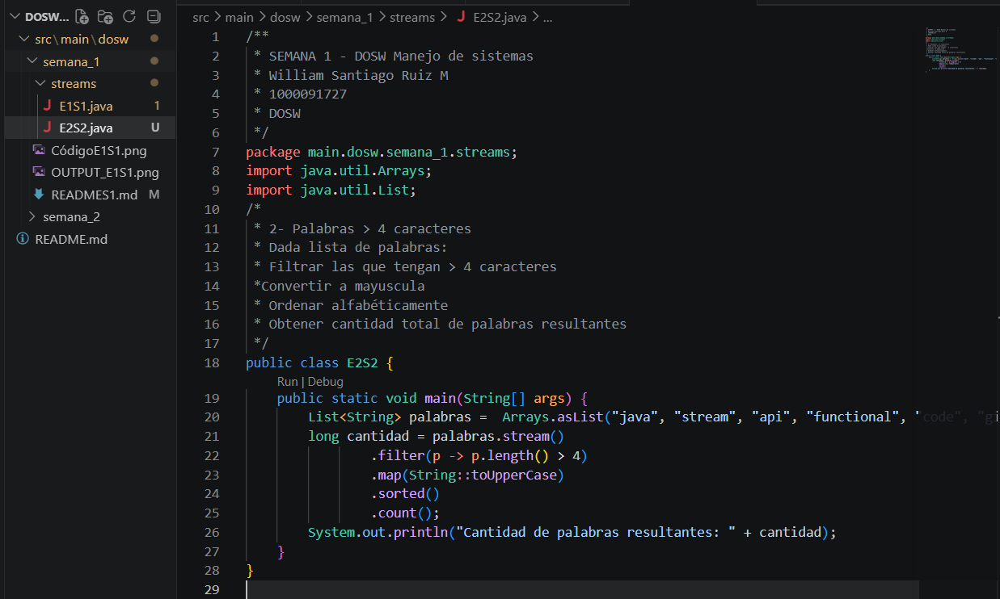
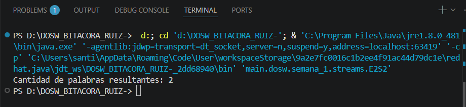

# SEMANA No 1 - DOSW Manejo de Streams 

## Datos Personales: 
- William Santiago Ruiz Medina
- ID: 1000091727
- DOSW 

### E1S1 - Números Pares mayores a diez

Dada una lista de números enteros obtener una nueva solo con los pares mayores a 10

**Codigo:**

**Captura de ejecución**

**Explicación**
Se crea una lista de enteros determinada, se filtra por los que cumplan con que sean pares y mayores que 10, se hace .collect y esto es lo que se mete en una nueva lista 

### E2S1 Palabras > 4 caracteres

 Dada lista de palabras: 
 - Filtrar las que tengan > 4 caracteres
 - Convertir a mayuscula
 - Ordenar alfabéticamente
 - Obtener cantidad total de palabras resultantes

**Codigo:**

**Captura de ejecución**

**Explicación**
Se tiene la lista de palabras, se filtra dejando pasar solo las que tengan longitud mayor de 4, se convierte a mayúscula cada una de estas con .map, y con .sorted se ordenan alfabeticamente

### E3S1 Obtener nombres de los Usuarios 

Dada una lista de usuarios con los atributos: id, name, age, active
Filtra únicamente los usuarios activos, obtén una lista con los nombres en mayúscula y ordenada alfabéticamente.

**Codigo:**

**Captura de ejecución**

**Explicación**

### E4S1  Personas mayores de edad 

**Codigo:**

**Captura de ejecución**

**Explicación**

### E5S1 Transacciones Bancarias

**Codigo:**

**Captura de ejecución**

**Explicación**

