# SEMANA No 2 - DOSW Manejo de Streams 

## Datos Personales: 
- William Santiago Ruiz Medina
- ID: 1000091727
- DOSW 

### E1S2 - Pokémon Tipo Fuego
Dada una lista de Pokémon con nombre y tipo, obtener únicamente aquellos cuyo tipo sea Fuego.

**Codigo:**

**Captura de ejecución**

**Explicación**
con la lista de pokemones, se hace .filter para filtrar los tipo fuego, luego .map para obtener solo su nombre, y luego .collect para pasar a la lista final 

### E2S2 - Pokédex Gritona 
Transformar todos los nombres de Pokémon a mayúsculas. 

**Codigo:**

**Captura de ejecución**

**Explicación**
Dada la lista de pokemones, se hace .map() para pasarlos a mayúsculas, luego los recolecta y arma la lista de nombres en mayusculas. 

### E3S2 - Poder total del Equipo 
Dada una lista de niveles de Pokémon, calcular la suma total de niveles del equipo. 

**Codigo:**

**Captura de ejecución**

**Explicación**
Con la lista ya dada de niveles se van sumando, el valor inicial es de 0, se aplica el .reduce para ir sumando los valores constantemente 

### E4S2 - Pokémon Alfa 
Encontrar el Pokémon con el nivel más alto dentro del equipo. 

**Codigo:**

**Captura de ejecución**

**Explicación**
Se tiene lista pokemon de nmobre y nivel, se usa el .max(comparator ...) para comparar según el nivel del pokemon, estamos buscando el de mayor nivel, y posteriormente se obtiene con el get 

### E5S2 - Pokémon Legendarios 
Contar cuántos Pokémon del equipo tienen nivel superior a 80.

**Codigo:**

**Captura de ejecución**

**Explicación**
Se tiene la lista de pokemones (nombre, nivel), filtramos con .filter() por los que tengan nivel mayor de 80, y los contamos con .count()

### E6S2 - Pokédex Sin Duplicados
Dada una lista de Pokémon con elementos repetidos, generar una nueva colección donde cada Pokémon 
aparezca una sola vez. 

**Codigo:**

**Captura de ejecución**

**Explicación**
Se tiene lista de pokemones con alñgunos repetidos, usamos  
.distinct() para eliminar estos duplicados, y luego un .collect() para ponerlos en la lista final 

### E7S2 - Orden del Profesor Oak
El Profesor Oak quiere su Pokédex organizada. Ordenar alfabéticamente los nombres de los Pokémon. 

**Codigo:**

**Captura de ejecución**

**Explicación**
Iniciamos con la lista desordenada, hacemos un .sorted() para ordenarla, y los metemos en la lista final con .collect()

### E8S2 - Evoluciones Preparadas
Dada una lista de Pokémon que incluye si pueden evolucionar (boolean puedeEvolucionar), obtener 
únicamente los que estén listos para evolucionar.

**Codigo:**

**Captura de ejecución**

**Explicación**

### A PARTIR DE ESTE PUNTO SE DEBE CREAR LA CLASE POKEMON 

**CODIGO CLASE POKEMON**

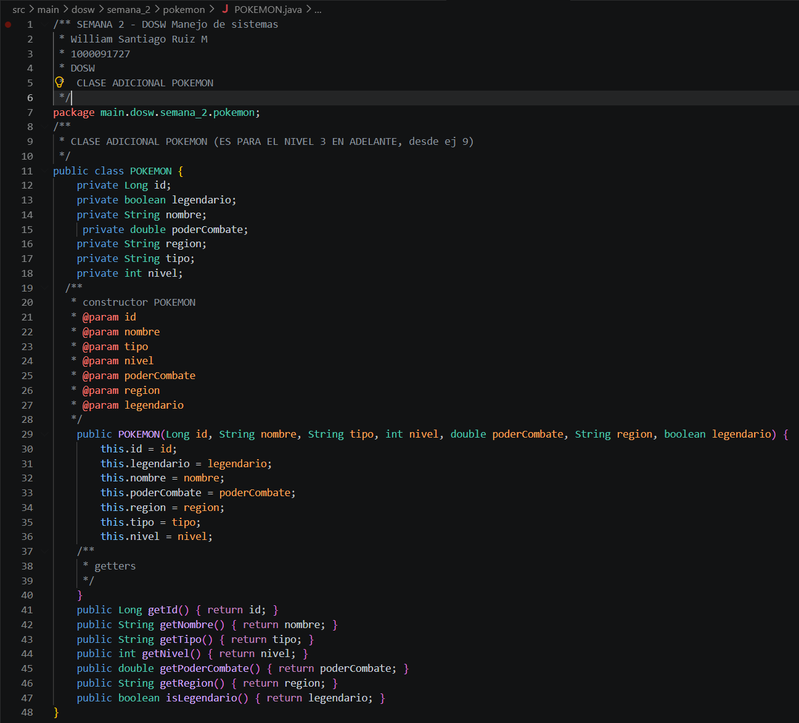

### E9S2 - Equipo Élite 

**Codigo:**

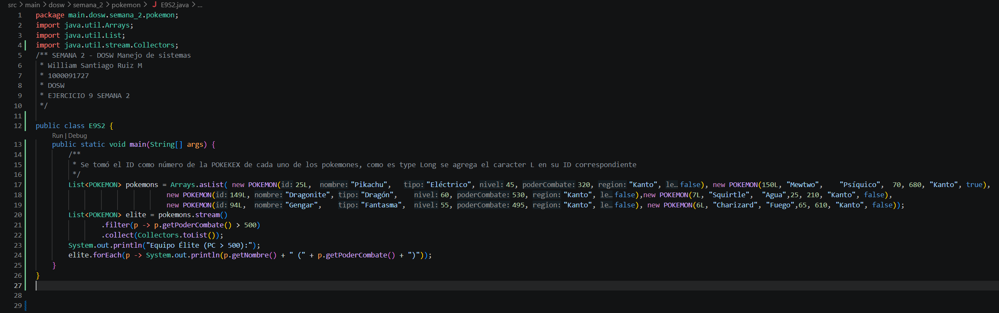

**Captura de ejecución**

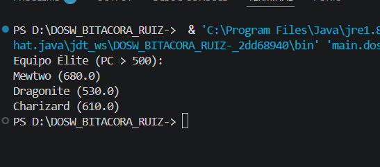

**Explicación**
Se tiene la lista de pokemones, ID es el numero de la pokedex, 
se aplica .filter() para que pasen solo los que tienen un poder mayor de 500
.collect() para pasarlos a la lista final, y luego un .forEach() para tener el output que corresponde al nombre de cada uno y sus poderes 

### E10S2 - Pokédex Compacta
Generar una lista que contenga únicamente los nombres de todos los Pokémon del equipo.

**Codigo:**

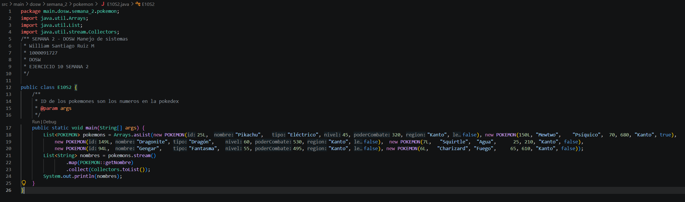

**Captura de ejecución**

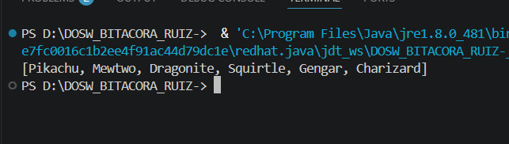

**Explicación**
Se tiene la lista de pokemones , luego aplicamos un .map() para sacar el nombre de los pokemones con el getNombre, se aplica un .collect() para meter los pókemones en la lista final 

### E11S2 - Poder Promedio 
Calcular el promedio de poderCombate de todos los Pokémon del equipo.

**Codigo:**

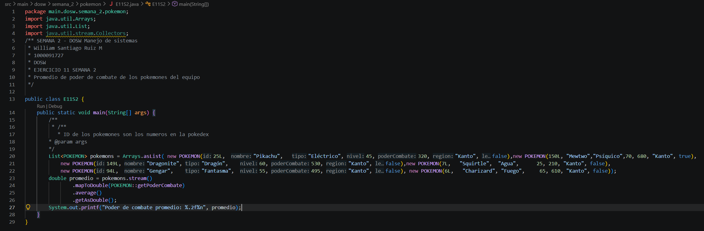

**Captura de ejecución**

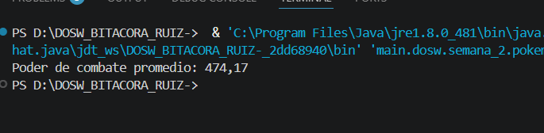

**Explicación**
se tiene la listya de pokemones, se quiere buscar solo el poder de combate de los pokemones, entonces se aplica un .map(), como se va a sacar el promedio el valor en este caso no será int sino double. 

se aplica un .average(), y finalmente obtenemos el valor final del promedio de poder de combate 

### E12S2 - Campeón Regional
Obtener el Pokémon con mayor poderCombate de toda la lista. 

**Codigo:**

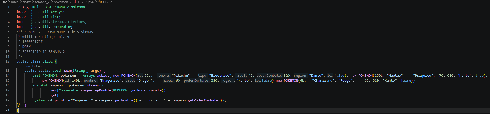

**Captura de ejecución**

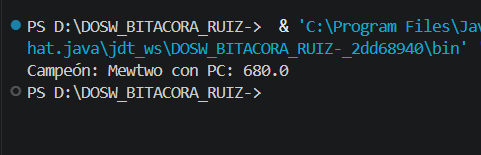

**Explicación**

Se recorren todos los pokemones y se determina el campeon regional como el que mayor poder de combate tenga 

### E13S2 -  Organizar por Tipo
Agrupar todos los Pokémon por su tipo y mostrar el listado por grupo. 

**Codigo:**

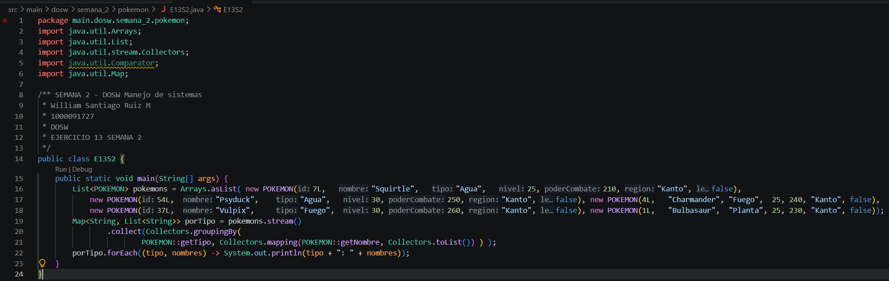

**Captura de ejecución**

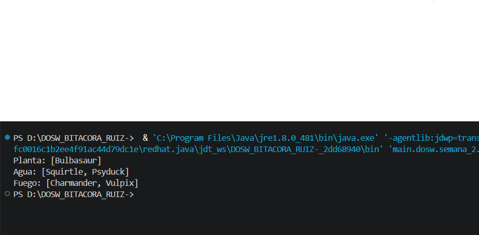

**Explicación**
agrupamos los pokemones según su tipo con un groupingBy() ,  y se extrae el nombre de cada pokemon de su gupo con un .map() , output es un Map que refleja el tipo como la key y el value como el nombre del pokemon 

### E14S2 -  Organizar por Región
Agrupar los Pokémon según su región de origen. 

**Codigo:**

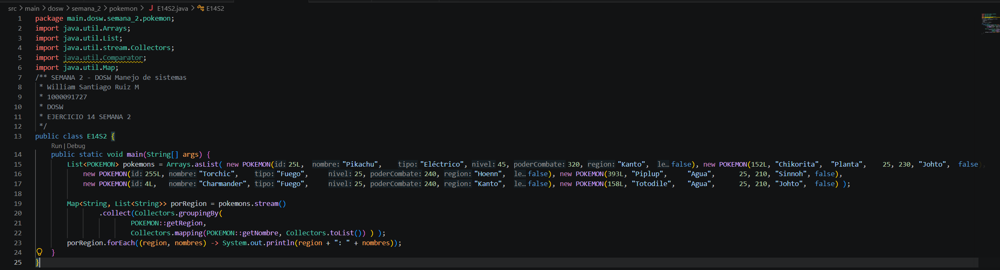

**Captura de ejecución**

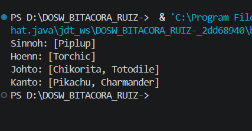

**Explicación**
Se aplica la misma estrategia del anterior pero buscando la region como conjunto comun en vez del tipo 

## A partir de ahora se necesita la clase entrenador: 

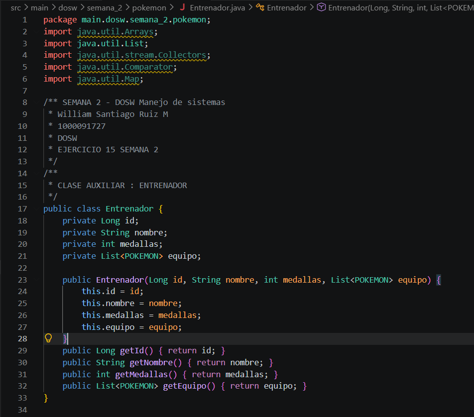

### E15S2 -  Maestro de Gimnasios
Dado un listado de entrenadores con sus medallas, encontrar el entrenador con más medallas. 

**Codigo:**

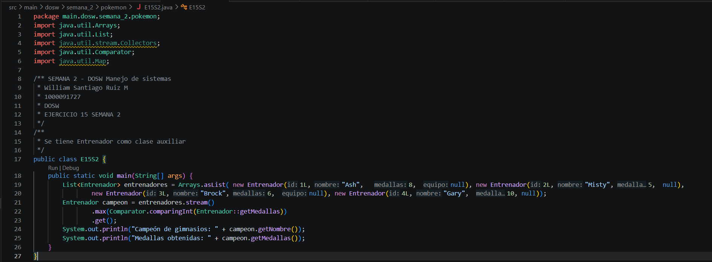

**Captura de ejecución**

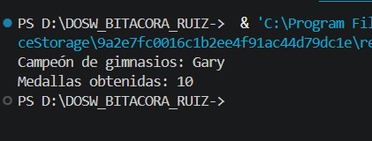

**Explicación**

### E16S2 - 

**Codigo:**

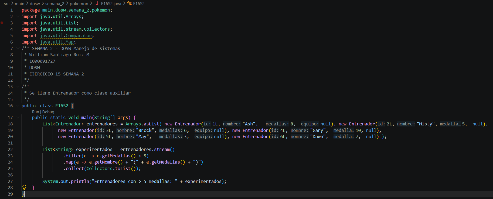

**Captura de ejecución**

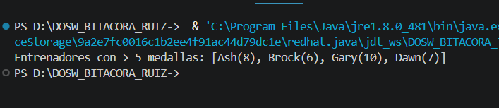

