# SEMANA No 2 - DOSW Manejo de Streams 

## Datos Personales: 
- William Santiago Ruiz Medina
- ID: 1000091727
- DOSW 

### E1S2 - Pokémon Tipo Fuego
Dada una lista de Pokémon con nombre y tipo, obtener únicamente aquellos cuyo tipo sea Fuego.

**Codigo:**

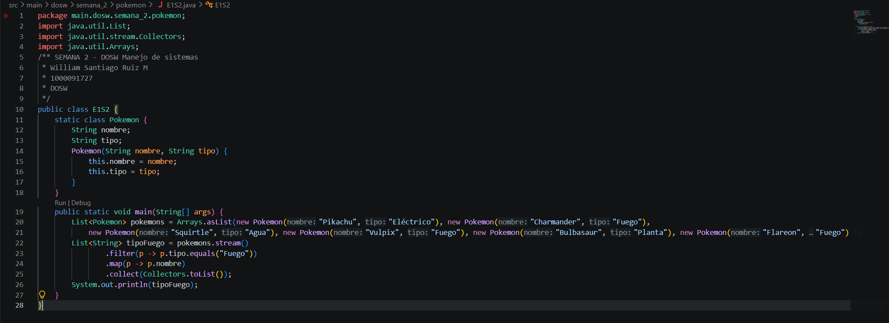

**Captura de ejecución**

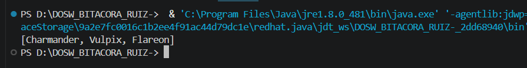

**Explicación**
con la lista de pokemones, se hace .filter para filtrar los tipo fuego, luego .map para obtener solo su nombre, y luego .collect para pasar a la lista final 

### E2S2 - Pokédex Gritona 
Transformar todos los nombres de Pokémon a mayúsculas. 

**Codigo:**

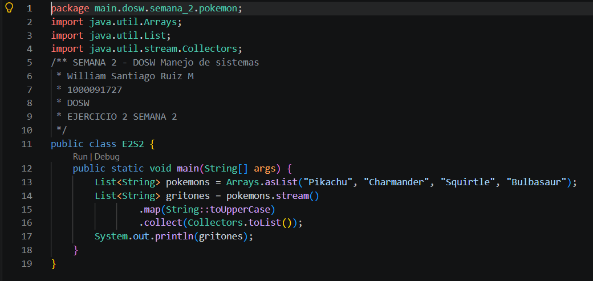

**Captura de ejecución**

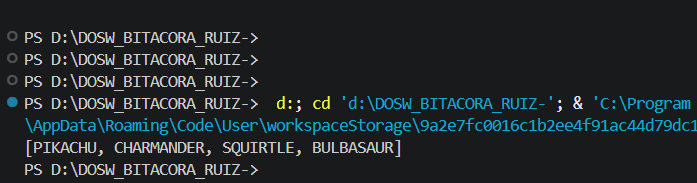

**Explicación**
Dada la lista de pokemones, se hace .map() para pasarlos a mayúsculas, luego los recolecta y arma la lista de nombres en mayusculas. 

### E3S2 - Poder total del Equipo 
Dada una lista de niveles de Pokémon, calcular la suma total de niveles del equipo. 

**Codigo:**

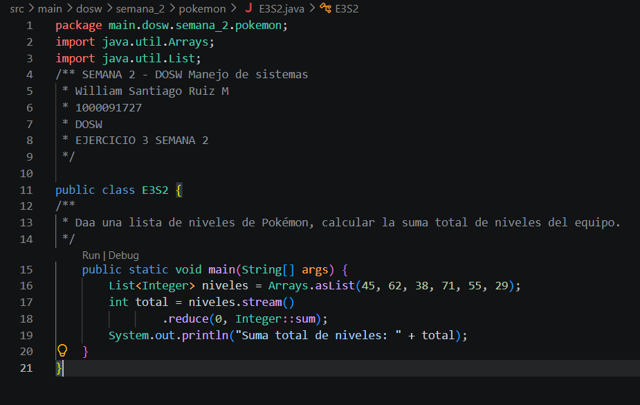

**Captura de ejecución**

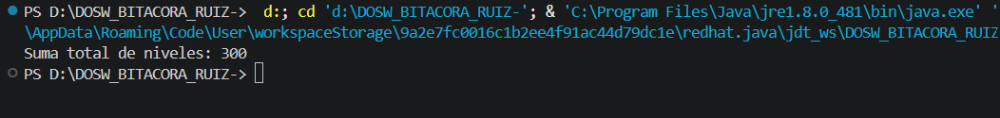

**Explicación**
Con la lista ya dada de niveles se van sumando, el valor inicial es de 0, se aplica el .reduce para ir sumando los valores constantemente 

### E4S2 - Pokémon Alfa 
Encontrar el Pokémon con el nivel más alto dentro del equipo. 

**Codigo:**

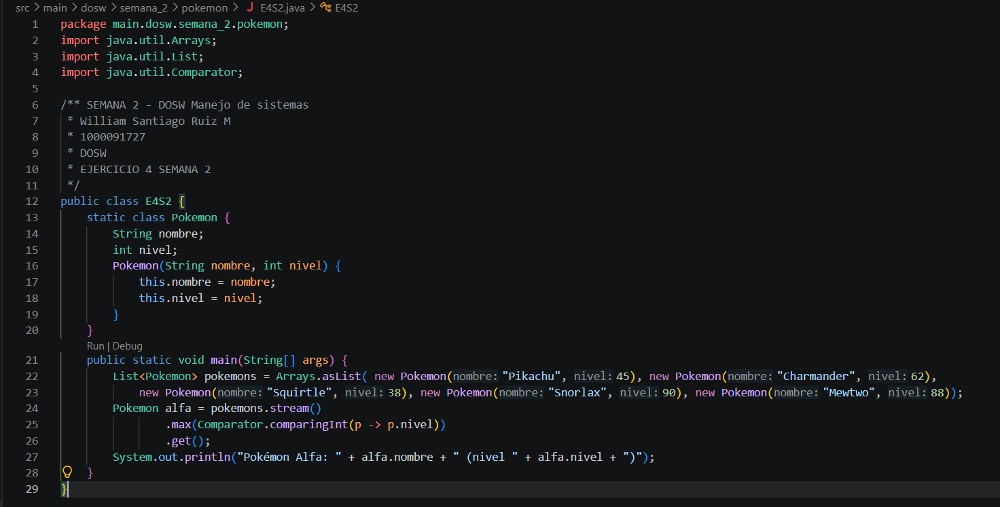

**Captura de ejecución**

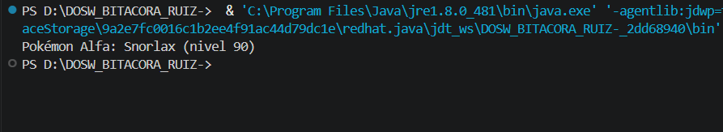

**Explicación**
Se tiene lista pokemon de nmobre y nivel, se usa el .max(comparator ...) para comparar según el nivel del pokemon, estamos buscando el de mayor nivel, y posteriormente se obtiene con el get 

### E5S2 - Pokémon Legendarios 
Contar cuántos Pokémon del equipo tienen nivel superior a 80.

**Codigo:**

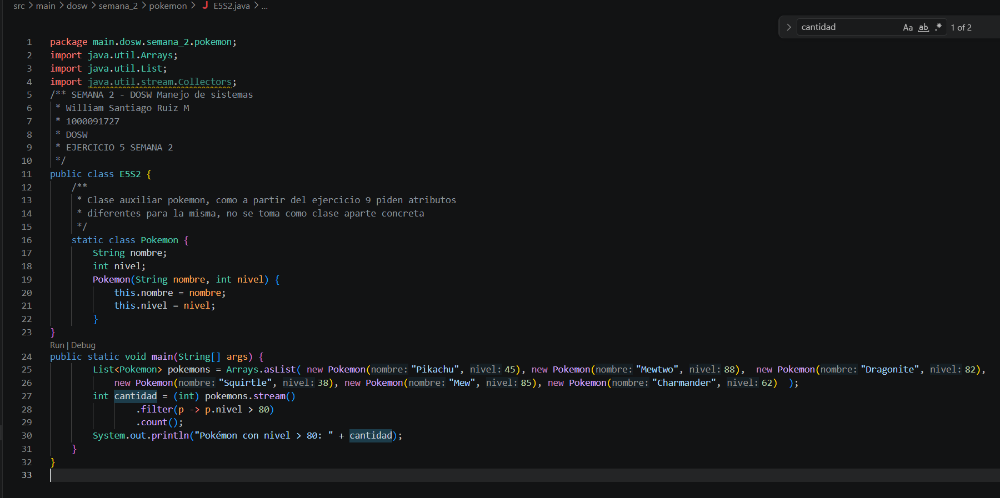

**Captura de ejecución**

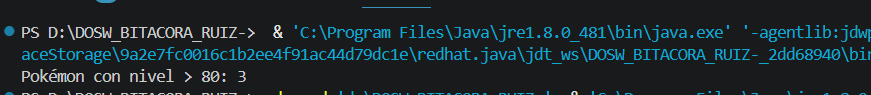

**Explicación**
Se tiene la lista de pokemones (nombre, nivel), filtramos con .filter() por los que tengan nivel mayor de 80, y los contamos con .count()

### E6S2 - Pokédex Sin Duplicados
Dada una lista de Pokémon con elementos repetidos, generar una nueva colección donde cada Pokémon 
aparezca una sola vez. 

**Codigo:**

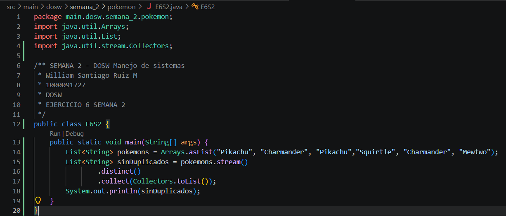

**Captura de ejecución**

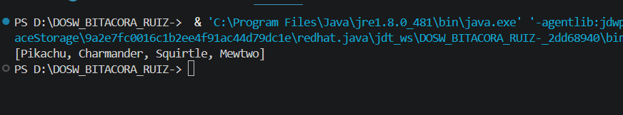

**Explicación**
Se tiene lista de pokemones con alñgunos repetidos, usamos  
.distinct() para eliminar estos duplicados, y luego un .collect() para ponerlos en la lista final 

### E7S2 - Orden del Profesor Oak
El Profesor Oak quiere su Pokédex organizada. Ordenar alfabéticamente los nombres de los Pokémon. 

**Codigo:**

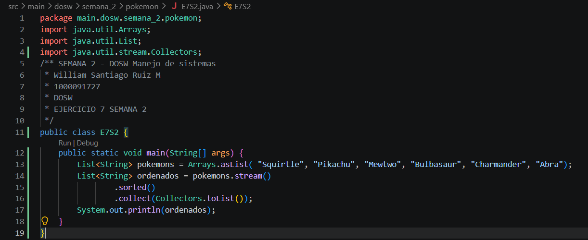

**Captura de ejecución**

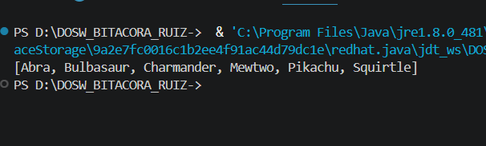

**Explicación**
Iniciamos con la lista desordenada, hacemos un .sorted() para ordenarla, y los metemos en la lista final con .collect()

### E8S2 - Evoluciones Preparadas
Dada una lista de Pokémon que incluye si pueden evolucionar (boolean puedeEvolucionar), obtener 
únicamente los que estén listos para evolucionar.

**Codigo:**

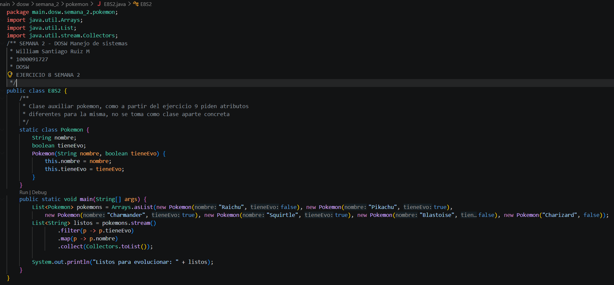

**Captura de ejecución**

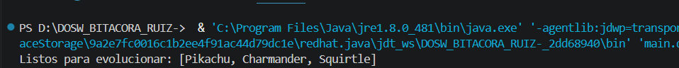

**Explicación**

### A PARTIR DE ESTE PUNTO SE DEBE CREAR LA CLASE POKEMON 

### E9S2 - Equipo Élite 

**Codigo:**
**Captura de ejecución**
**Explicación**

