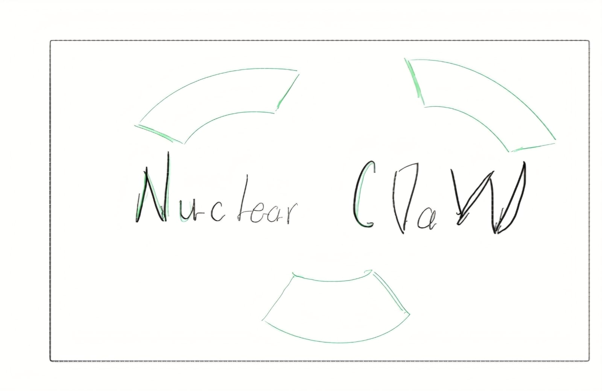
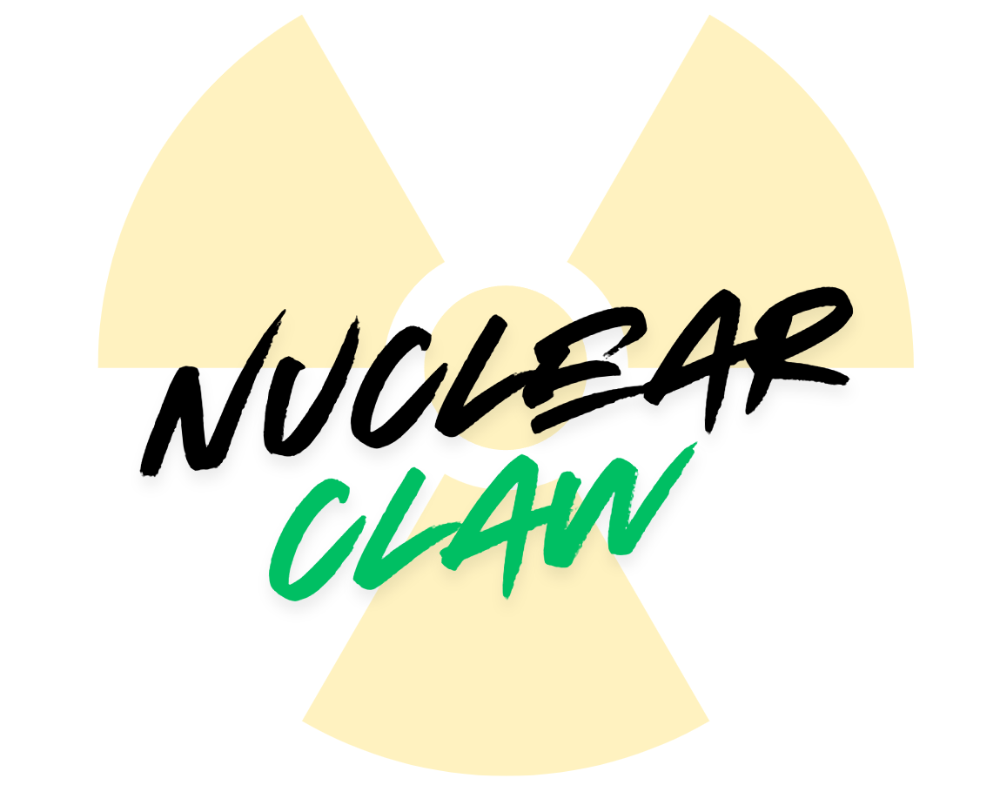
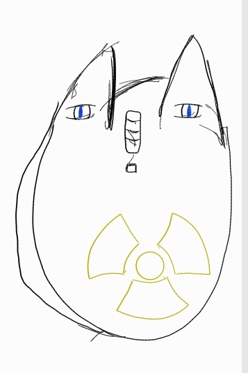
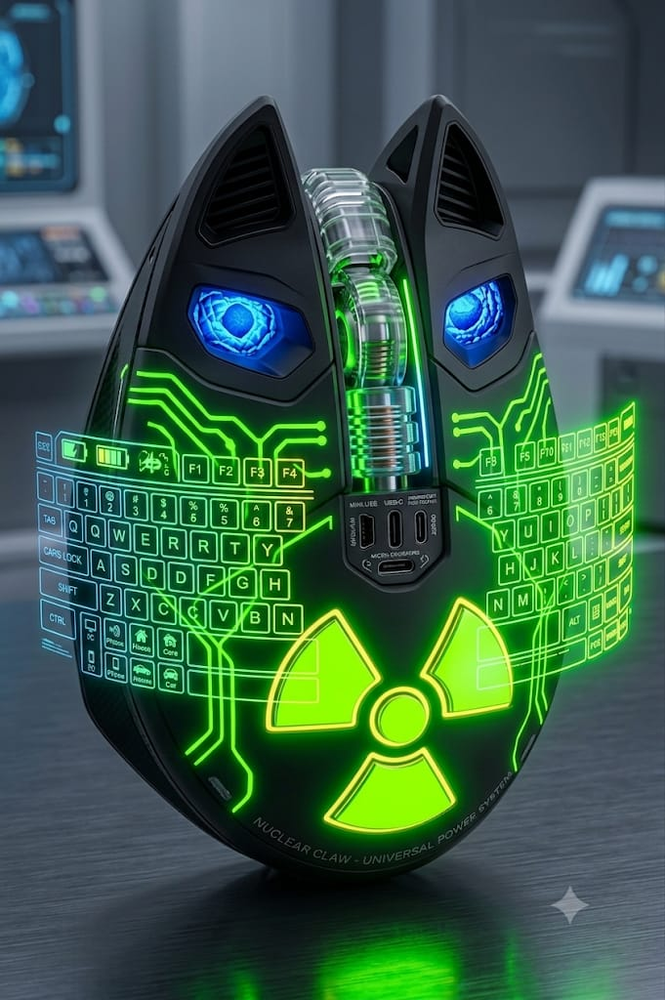

"#DOSW_BITACORA" 
### MANUAL DE IDENTIDAD 
## William Santiago Ruiz Medina 
## ID: 1000091727
## SEMANA 3 DOSW 

- NOMBRE: Nuclear Claw 
- Slogan: Energía infinita en la plama de tu mano 
- Tipografía LOGO: Hyperwave One 
- Paleta de colores: negro(#000000), verde neon(#00bf63), y amarillo neon (#ffdb4a)
- Publico objetivo: Personas apasionadas por tecnología de vanguardia, dispuestas a pagar premium por innovación real. Viven conectados, usan múltiples dispositivos simultáneamente y odian quedarse sin batería, así mismo familias o personas que quieren simplificar su infraestructura eléctrica del hogar. Un solo dispositivo que alimenta teléfonos, autos y sistemas eléctricos es una propuesta de valor enorme para quienes buscan eficiencia y minimalismo.

- Nuclear Claw es un mouse inalámbrico que se alimenta por medio de una fuente de energía nuclear interna que le proporciona energía infinita, genera un teclado holográfico al detectar las ondas neuronales del usuario quien puede solicitar el teclado con solo pensarlo, así mismo nuclear claw al ser tan compacto puede usarse como fuente de alimentación para cualquier cosa: Teléfonos, Autos, Computadores, Sistemas eléctricos de casas, letc... Nuclear Claw puede con ello, su sistema interno aloja también a michi, un agente de IA que se encarga de cambiar de manera inteligente la corriente que se administra a los dispositivos que Nuclear Claw carga de tal manera que evita daños por sobrecarga. Sólo basta con acercar tu Nuclear Claw a menos de 50Cm del dispositivo que quieres cargar y automáticamente empézará a regenerar su energía por medio de la gestión de michi, o si quieres puedes usar uno de sus multiples puertos de conexión 

## ELEMENTOS VISUALES: 

## BOCETO LOGO: 

## LOGO: 

## BOCETO PRODUCTO: 

## PRODUCTO: 

