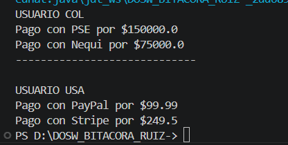
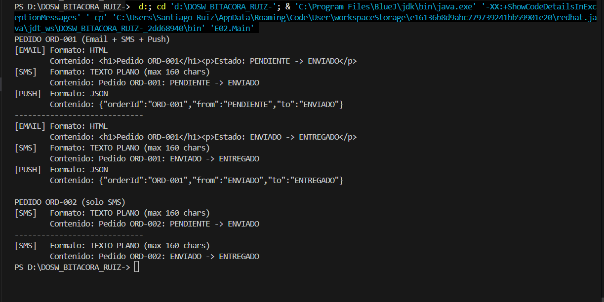
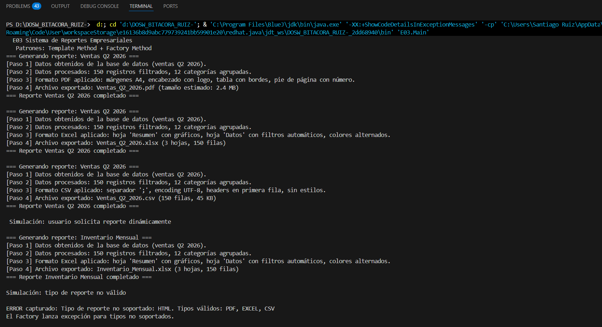
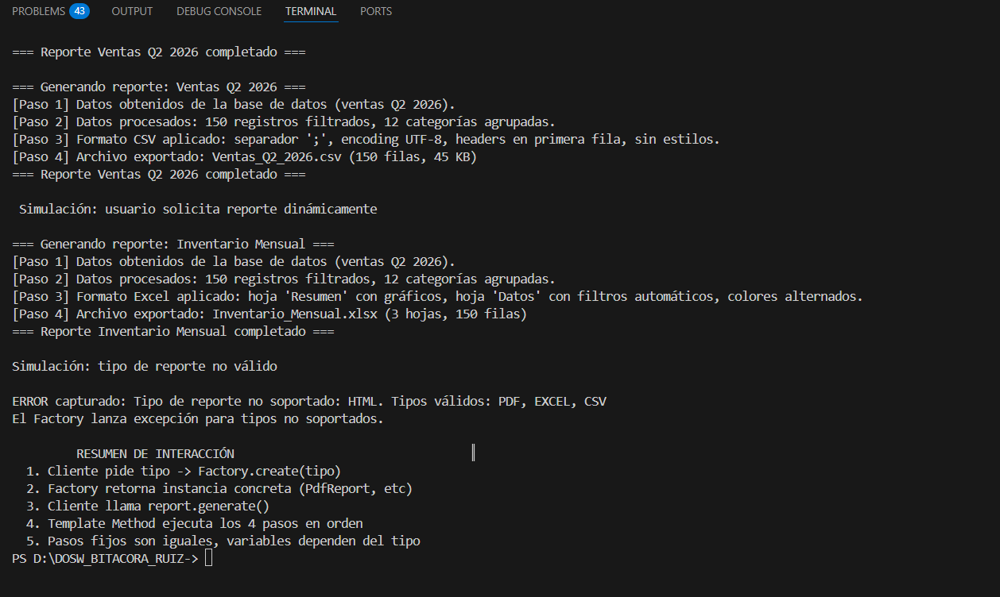

# SEMANA No 2 - PATRONES DE DISEÑO 

## Datos Personales: 
- William Santiago Ruiz Medina
- ID: 1000091727
- DOSW 

### E1S3 Plataforma de Pagos Inteligentes

Una aplicación de e-commerce permite pagar con tarjeta, PSE, Nequi, PayPal y transferencia bancaria. Cada
medio tiene una lógica distinta pero el flujo de compra es el mismo. Además, según el país del usuario, el
sistema construye el proveedor de pago correcto (Colombia → PSE/Nequi, USA → PayPal/Stripe).

### OUTPUT

### Explicación del rol de cada patrón 

Strategy: Aplica encapsulamiento permitiendo polimorfismo, ya que por ejemplo checkout solo sabe que debe tener la suma de dinero si importar el método, por otro lado process() se encarga de hacer algo diferente en función de que método de pago se usa, es decir puede cobrar por los diferentes medios de pago disponibles 

Factory Method: Crea el proovedor pago en fucnión de si es COL o USA,, ColombiaPaymentFactory y UsaPaymentFactory tienen conocimiento de sus propios medios de pago locales, cada una de estas Payment 

### INTERACCIÓN:
Usuario escoge país, luego obtiene la PaymentFactory (Colombia o Usa), se construye con esta una PaymentStrategy por medio de create(), esta strategy se usa en el checkout que llama a strategy.process(amount), pero esto sin tener conocimiento del medio de pago se está usando

### E2S3 Sistema de Notificaciones Multicanal

Cuando un pedido cambia de estado (pendiente → enviado → entregado), el sistema notifica por correo,
SMS, WhatsApp y push. No todos los usuarios tienen activos los mismos canales. Cada canal tiene su
propia forma de construir y formatear el mensaje.

## OUTPUT 

### E3S3 Sistema de reportes Empresariales

# Rol de cada patrón: 

-  Template Method Define la estructura fija del algoritmo en ReportGenerator. El método final generate() ejecuta los 4 pasos en orden. Las subclases (PdfReport, ExcelReport, CsvReport) solo sobreescriben los pasos variables: applyFormat() y exportFile().

- Factory: ReportFactory.create("PDF") retorna la instancia correcta sin que el cliente conozca las clases concretas. El cliente nunca instancia PdfReport directamente.

## Interacción: 

- PASOS: 
 Cliente pide reporte de PDF, ReportFactory.create("PDF") crea el reporte, se llama al report.generate(), luego el patrón Template hace los pasos. 

## OUTPUT

### E4S3 

## Rol de cada patrón:

- Builder: WarriorBuilder construye el personaje paso a paso al inicio de la partida. Permite encadenar setArmor().setWeapon().setSkill().build() sin necesitar un constructor con múltiples parámetros. El personaje resultante es inmutable una vez construido.

- Decorator: ShieldDecorator, SpeedDecorator e InvisibilityDecorator envuelven el personaje y agregan poderes temporales en runtime sin modificar la clase base Warrior

## Interacción:

- PASOS:
El WarriorBuilder construye el personaje base, durante la partida los Decorators envuelven el personaje agregando poderes temporales, al terminar el efecto el wrapper se descarta y el personaje base queda intacto

## OUTPUT: 

